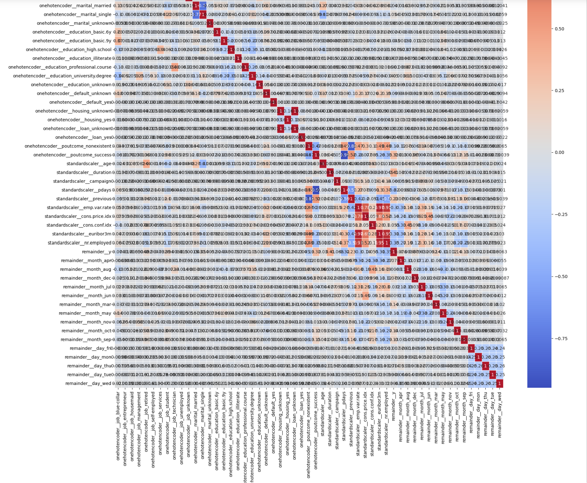

# Bank Deposit Marketing Campaign
This project is a part of the [UC Irvine Machine Learning Repository](https://archive.ics.uci.edu/dataset/222/bank+marketing)
Typical marketing campaigns calling customers to improve term deposits has 1% success rates. ML initiatives can help in this regard

## Project Intro/Objective
Improve resource utilization, time and effort using targetted marketing.
The purpose of this project is to use machine learning techniques identify customers who are likely to pay attantion to the marketing campaign
and consider or invest in term deposits with the bank. Idea is to improve the 1% success rates to much larger %'s so 99% wasted time and resource
can be leveraged optimally targetting the right customers.

## Project Description
Bank has collected 21 features or columns of around 41188 rows or records. These are statistics and data about the clients. Marketing term deposit inciscriminately to all these clients historically has given a success rate of 1%. Not just a low success rate but has given bad customer experience.
This initiative is to statistically study the clients, category of clients, observe their pattern, past success on term deposits, financial potential and come up with target clients to market the product (term deposits). Idea is to spend resource, time, effort and cater to better customer experience. 

## Phased project execution processes
1. Clone this repo (UC Irvine ML Repo [Detailed Dataset to Download](https://archive.ics.uci.edu/dataset/222/bank+marketing)).
2. Understand the business challenges, use case, problem to solve, features used in the dataset, co-relation understanding with target and among features 
3.EDA(Exploratory Data Analysis)
    * Analyze for null values, undefined values, quantity of each, normalized baseline target outcome
    * Drop features that are of minimal to no use to analyze the target column. Balance tradeoffs between data imputng vs dropping based on quantity missing
    * Identify what features are categorical, ordinal and scalar.
    * Reduce features to the absolute minimum and essential features dataset.
    * Prepare features using column transformation of the dataset based on feature identification.
    * treating data - Feature Columns transformation (onehot encoding, label encoding, passthroguh or standardscalar)
3. Once Data transformation has been completed analyze the number of features that we end up with. In this case is large. (55 to be precise)
4. Since the dataset has too many features and also as a best practice analyze the dataset with corelation matrix. Preferably setting thresholds and drop features that are highly corelated in this case (>.7) is being used. Dropping 7 features ending up with 48 features to analyze.

5. While this may be good to fit classification models it is still too large for model hyperparameter tweaks and finetuning. 
6. Adopt techniques to further strip down just the bare essentil features to tackle or identify this classification outcome. RandomForest is being used in this case to reduce the features to 5 to bring it down to managable features for classification.

7. Test out all major classification models benchmarking fit times, accuracy and interpretability.

8. Decide on the best classifier model, tweak it for better accuracy.

9. Eventually implement / train the model with best hyper parameters to get accurate desired outcome.
10. Our desired outcome in this case is For the given customer the model should give an output of "1" for potential customer to target or "0" not a customer to target for term deposit clientel. Using this bank can decide to either place a call or refrain from marketing term deposit product to the customer.

## Key takeaway from the Analysis
* Tradeoff
- Observe ROC curve and decide on the best model to use ( or sweetspot) based on the business need. In this case we want to maintain maximum accuracy targetting the right client. So reducing false positive is important as well.
- Since this may not be a dynamic input and can be pre analyzed before deploying a marketing campaign we could perform modeling ahead of time with an accaptble compute costs to the business.
- Based on the accuracy and ROC curve tradeoffs we have come up with three model choices. 
** Choice (1) SVM using SVC and all 48 features with accuracy (91.5%) seems to be a better fit for our application 
** Choice (2) If computing $ is a concern then RandomForestClassifier(FeatureReduction to 5 features)+SVC accuracy(91.22%)
** Choice (3) Logistic Regression with accuracy of (91.07%) , can target customers but false possitives are a bit more 

* Key Features
In the event that compute expense is tight and we want to minimize the compute time one effective way is to reduce the features from 48 to absolute bare minimum. In this case we reduced it using RandomForestClassifier to 5
- poutcome_success, This feature is the outcome of the previous campaign if it had a successful acceptance during campaign.
- age, age of the client seems to be a good feature to decide the client as target or not.
- duration, duration of the contact is critical to model decision as a ideal target or not.
- enm.var.rate, this seems to be employment variability rate of the client. Perhaps its referig to the change of employment. It is one of the feature that is missing in the dataset description.
- con.conf.idx, Consumer confidence index, Its a measure of economic health and how the client feels about the economy.

## Improving Outcomes or refining our model
* Further analysis obtaining clear plots ROC and Confusion Matrix.
- I am including RandomForestClassification+SVC model plots for reference.

- Budget and time permitting one of the choice of the models can be further tuned using GridSearchCV and accuracy could be improved. One such metric is given in the code comments section.

## Results
Business context, when the bank contacted its target clients or so called target clients majority of the clients declined to enroll in term based deposits. Analyzing the given data set 88.73% declined to enroll.  
In DataScience language, baseline accuracy of the majority outcome "0" of the given data set was 88.73%
Post DataScience techniques baed on the quantitative statistical analysis and modeling we can target clients with > 90%
accuracy so that majority of the targetted clients would enroll in term based deposit product.

## Next Step to further improve the results
- Further improve the SVM model using gridsearchCV trying out various hyperparameters and kernels requires powerful computing
- Attempts to do grid search to optimize hyper paramater is causing multiple hours or perhaps even days to develop results. I managed to capture one result and its recorded in the comments section below
- SVM (all Features  or 48 features ) - svc for sigmoid kernel - only successful result after few hours of computing.
###Recorded output
- Reduced X_train and X_test Size (32950, 5) (8238, 5)
- Selected features post reduction by RandomForest: ['onehotencoder__poutcome_success', 'standardscaler__age', 'standardscaler__duration', 'standardscaler__emp.var.rate', 'standardscaler__cons.conf.idx']
- Model: Optimized SVM svc Best paramaters C, gamma 0.1 0.1
- optimized_svm_model = SVC(kernel='sigmoid', C=best_C, gamma=best_gamma)
- Accuracy: 0.8868657441126487
- Fit Time: 12.2160 seconds
- More computing, spending time and resource are required to improve the model beyond 90%+ accuracy.

## Contact 
* Author: Abdul Ghouse, email: aghouse@gmail.com
